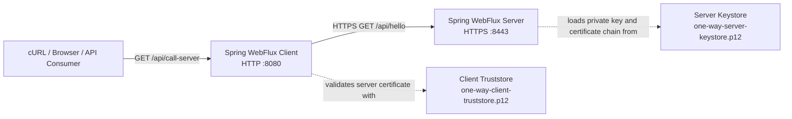

# Spring Boot 4.x One-Way SSL/TLS with WebFlux

This repository is a **Proof of Concept (PoC)** demonstrating One-Way SSL/TLS communication between two independent Spring Boot WebFlux applications:

- **SSL Server** — exposes an HTTPS endpoint on port `8443`
- **SSL Client** — exposes an HTTP endpoint on port `8080` and calls the server through a TLS-enabled reactive `WebClient`

The project uses Spring Boot's centralized **SSL Bundles** configuration with PKCS#12 keystores and truststores. The client application also demonstrates how to build a Netty-compatible `SslContext` from an `SslBundle` for Reactor Netty.

## Technology Stack

- Java 17
- Spring Boot 4.0.7
- Spring WebFlux
- Reactor Netty
- Spring Boot SSL Bundles
- PKCS#12 keystore and truststore
- OpenSSL and Java `keytool`

## One-Way TLS Concept

In One-Way TLS, only the server presents a certificate during the TLS handshake.

1. The server sends its certificate chain to the client
2. The client validates the certificate against its truststore
3. The client verifies that the requested hostname matches the certificate Subject Alternative Name
4. Both sides negotiate encrypted session keys
5. The HTTP request and response are transmitted through the encrypted connection

The server does **not** require the client to present a certificate. Client authentication at the TLS layer is therefore not enabled.

> One-Way TLS authenticates the server and protects data in transit. It does not replace application-level authentication or authorization such as OAuth 2.0, JWT, API keys, or session-based authentication.

## Architecture



## Repository Structure

```text
spring-boot-one-way-ssl/
├── certs/
│   ├── one-way-ca.crt
│   ├── one-way-ca.key
│   ├── one-way-ca.srl
│   ├── one-way-client-truststore.p12
│   ├── one-way-server-ext.cnf
│   ├── one-way-server.crt
│   ├── one-way-server.csr
│   ├── one-way-server.key
│   └── one-way-server-keystore.p12
│
├── spring-one-way-ssl-client/
│   ├── pom.xml
│   └── src/
│       ├── main/
│       │   ├── java/com/tirmizee/
│       │   │   ├── config/WebClientConfig.java
│       │   │   └── controller/ClientController.java
│       │   └── resources/
│       │       ├── application.yaml
│       │       └── certs/one-way-client-truststore.p12
│       └── test/
│
└── spring-one-way-ssl-server/
    ├── pom.xml
    └── src/
        ├── main/
        │   ├── java/com/tirmizee/
        │   │   └── controller/HelloController.java
        │   └── resources/
        │       ├── application.yaml
        │       └── certs/one-way-server-keystore.p12
        └── test/
```

## Certificate Components

| File | Purpose |
|---|---|
| `one-way-ca.crt` | Public certificate of the local Certificate Authority used to sign the server certificate |
| `one-way-ca.key` | Private key of the local Certificate Authority |
| `one-way-server.key` | Server private key |
| `one-way-server.csr` | Certificate Signing Request for the server |
| `one-way-server.crt` | Server certificate signed by the local CA |
| `one-way-server-ext.cnf` | Certificate extensions containing SAN and key-usage settings |
| `one-way-server-keystore.p12` | Server private key and certificate chain used by the HTTPS server |
| `one-way-client-truststore.p12` | Trusted certificate material used by the client to validate the server |

> **Security warning:** The certificates, private keys, truststore password, and keystore password in this repository are for local development only. Never reuse them in production, and never commit production private keys or secret passwords to source control.

## Prerequisites

- JDK 17 or later
- OpenSSL
- Java `keytool`
- A terminal that can run the Maven Wrapper

Verify Java:

```bash
java -version
```

Verify OpenSSL:

```bash
openssl version
```

## Quick Start

The repository already contains development certificates, so the PoC can be started without generating new certificates.

### 1. Start the SSL Server

Open the first terminal:

```bash
cd spring-one-way-ssl-server
./mvnw clean spring-boot:run
```

The server starts at:

```text
https://localhost:8443
```

### 2. Start the SSL Client

Open the second terminal:

```bash
cd spring-one-way-ssl-client
./mvnw clean spring-boot:run
```

The client starts at:

```text
http://localhost:8080
```

### 3. Test the End-to-End Flow

Call the client application:

```bash
curl http://localhost:8080/api/call-server
```

Expected response:

```json
{
  "message": "Hello from 1 Way SSL Server"
}
```

The request flow is:

```text
cURL
  -> HTTP :8080
  -> Spring WebFlux Client
  -> HTTPS :8443
  -> Spring WebFlux Server
```

### 4. Test the HTTPS Server Directly

Run this command from the repository root:

```bash
curl \
  --cacert certs/one-way-ca.crt \
  https://localhost:8443/api/hello
```

Using `--cacert` verifies the server certificate against the PoC CA certificate.

Do not use the following command as proof that certificate validation works:

```bash
curl -k https://localhost:8443/api/hello
```

The `-k` option disables certificate verification and bypasses the trust model being demonstrated.

## Server-Side SSL Configuration

The server uses the `one-way-server` SSL bundle as its embedded web-server identity.

`spring-one-way-ssl-server/src/main/resources/application.yaml`

```yaml
server:
  port: 8443
  ssl:
    enabled: true
    bundle: one-way-server

spring:
  application:
    name: spring-one-way-ssl-server

  ssl:
    bundle:
      jks:
        one-way-server:
          key:
            alias: one-way-server
          keystore:
            location: classpath:certs/one-way-server-keystore.p12
            password: changeit
            type: PKCS12
```

Although the configuration namespace is named `jks`, Spring Boot also supports PKCS#12 stores through this bundle type.

The server bundle contains:

- The server private key
- The server certificate
- The certificate chain
- The key alias `one-way-server`

The server is not configured to require a client certificate, which makes this a One-Way TLS configuration rather than Mutual TLS.

## Client-Side SSL Configuration

The client uses the `one-way-client` SSL bundle to validate the server certificate.

`spring-one-way-ssl-client/src/main/resources/application.yaml`

```yaml
server:
  port: 8080

secure-server:
  base-url: https://localhost:8443
  ssl-bundle: one-way-client

spring:
  application:
    name: spring-one-way-ssl-client

  ssl:
    bundle:
      jks:
        one-way-client:
          truststore:
            location: classpath:certs/one-way-client-truststore.p12
            password: changeit
            type: PKCS12
```

The client only requires a truststore because it validates the server but does not present a client certificate.

## Reactor Netty `WebClient` Configuration

Spring Boot exposes bundle material through `SslBundles`. The current PoC retrieves the configured bundle and uses its manager factories to build an `io.netty.handler.ssl.SslContext` for Reactor Netty.

`spring-one-way-ssl-client/src/main/java/com/tirmizee/config/WebClientConfig.java`

```java
@Configuration
public class WebClientConfig {

    @Value("${secure-server.base-url}")
    private String baseUrl;

    @Value("${secure-server.ssl-bundle}")
    private String sslBundleName;

    @Bean
    WebClient webClient(SslBundles sslBundles) throws SSLException {
        var sslBundle = sslBundles.getBundle(sslBundleName);
        var sslOptions = sslBundle.getOptions();
        var managers = sslBundle.getManagers();

        var sslContextBuilder = SslContextBuilder.forClient()
                .keyManager(managers.getKeyManagerFactory())
                .trustManager(managers.getTrustManagerFactory());

        if (sslOptions.getEnabledProtocols() != null) {
            sslContextBuilder.protocols(sslOptions.getEnabledProtocols());
        }

        if (sslOptions.getCiphers() != null) {
            sslContextBuilder.ciphers(
                    Arrays.stream(sslOptions.getCiphers()).toList()
            );
        }

        SslContext nettySslContext = sslContextBuilder.build();

        var httpClient = HttpClient.create()
                .secure(spec -> spec.sslContext(nettySslContext));

        return WebClient.builder()
                .baseUrl(baseUrl)
                .clientConnector(new ReactorClientHttpConnector(httpClient))
                .build();
    }
}
```

### Why a Netty `SslContext` Is Built Manually

`SslBundle#createSslContext()` creates a JDK `javax.net.ssl.SSLContext`, while the low-level Reactor Netty configuration used by this PoC accepts Netty's `io.netty.handler.ssl.SslContext`.

The implementation therefore retrieves the `KeyManagerFactory` and `TrustManagerFactory` from the bundle and supplies them to Netty's `SslContextBuilder`.

The client bundle contains trust material only. No client private key or client certificate is required for the One-Way TLS handshake.

### Null-Safe Protocol and Cipher Configuration

Protocols and cipher suites are optional SSL bundle settings. When they are omitted from YAML, the corresponding option arrays may be `null`.

The PoC checks each value before applying it:

```java
if (sslOptions.getEnabledProtocols() != null) {
    sslContextBuilder.protocols(sslOptions.getEnabledProtocols());
}

if (sslOptions.getCiphers() != null) {
    sslContextBuilder.ciphers(
            Arrays.stream(sslOptions.getCiphers()).toList()
    );
}
```

When these settings are absent, Reactor Netty and the selected SSL provider use their supported defaults instead of failing application startup.

## Spring Boot-Native `WebClientSsl` Alternative

Spring Boot 4 also provides `WebClientSsl`, which can apply an SSL bundle directly to a Boot-managed `WebClient.Builder`.

The repository currently uses the manual Reactor Netty approach to demonstrate access to the bundle's lower-level manager factories. For straightforward client configuration, the Boot-native alternative is more concise:

```java
import org.springframework.boot.webclient.autoconfigure.WebClientSsl;

@Bean
WebClient webClient(
        WebClient.Builder builder,
        WebClientSsl webClientSsl,
        @Value("${secure-server.base-url}") String baseUrl,
        @Value("${secure-server.ssl-bundle}") String bundleName
) {
    return builder
            .baseUrl(baseUrl)
            .apply(webClientSsl.fromBundle(bundleName))
            .build();
}
```

This alternative is not the implementation currently used by the repository.

## API Endpoints

### SSL Server

```http
GET https://localhost:8443/api/hello
```

Response:

```json
{
  "message": "Hello from 1 Way SSL Server"
}
```

### SSL Client

```http
GET http://localhost:8080/api/call-server
```

The client calls the SSL server through its configured `WebClient` and returns the server response.

## Generate New Development Certificates

The commands below recreate the same certificate model used by the repository:

```text
Local CA
   └── signs
       └── Server Certificate
```

Run the commands from the repository root.

### 1. Create the Local Certificate Authority

```bash
mkdir -p certs
cd certs

openssl genrsa \
  -out one-way-ca.key \
  4096

openssl req \
  -x509 \
  -new \
  -sha256 \
  -days 3650 \
  -key one-way-ca.key \
  -out one-way-ca.crt \
  -subj "/CN=One Way SSL Local CA"
```

### 2. Create the Server Private Key and CSR

```bash
openssl genrsa \
  -out one-way-server.key \
  2048

openssl req \
  -new \
  -sha256 \
  -key one-way-server.key \
  -out one-way-server.csr \
  -subj "/CN=localhost"
```

### 3. Add Subject Alternative Names

Create `one-way-server-ext.cnf`:

```ini
subjectAltName=DNS:localhost,IP:127.0.0.1
extendedKeyUsage=serverAuth
keyUsage=digitalSignature,keyEncipherment
```

The SAN extension is required for hostname verification. The current configuration supports both `localhost` and `127.0.0.1`.

### 4. Sign the Server Certificate

```bash
openssl x509 \
  -req \
  -sha256 \
  -days 825 \
  -in one-way-server.csr \
  -CA one-way-ca.crt \
  -CAkey one-way-ca.key \
  -CAcreateserial \
  -out one-way-server.crt \
  -extfile one-way-server-ext.cnf
```

### 5. Create the Server PKCS#12 Keystore

```bash
openssl pkcs12 \
  -export \
  -name one-way-server \
  -inkey one-way-server.key \
  -in one-way-server.crt \
  -certfile one-way-ca.crt \
  -out one-way-server-keystore.p12 \
  -passout pass:changeit
```

The alias must match the server configuration:

```yaml
key:
  alias: one-way-server
```

### 6. Create the Client PKCS#12 Truststore

```bash
keytool \
  -importcert \
  -noprompt \
  -alias one-way-ca \
  -file one-way-ca.crt \
  -keystore one-way-client-truststore.p12 \
  -storetype PKCS12 \
  -storepass changeit
```

### 7. Copy the Stores into Both Applications

From the `certs` directory:

```bash
cp one-way-server-keystore.p12 \
  ../spring-one-way-ssl-server/src/main/resources/certs/

cp one-way-client-truststore.p12 \
  ../spring-one-way-ssl-client/src/main/resources/certs/
```

Restart both applications after replacing the stores.

## Inspect the Generated Certificates

Inspect the server certificate:

```bash
openssl x509 \
  -in certs/one-way-server.crt \
  -noout \
  -subject \
  -issuer \
  -dates \
  -ext subjectAltName
```

Inspect the server keystore:

```bash
keytool \
  -list \
  -v \
  -storetype PKCS12 \
  -keystore spring-one-way-ssl-server/src/main/resources/certs/one-way-server-keystore.p12 \
  -storepass changeit
```

Inspect the client truststore:

```bash
keytool \
  -list \
  -v \
  -storetype PKCS12 \
  -keystore spring-one-way-ssl-client/src/main/resources/certs/one-way-client-truststore.p12 \
  -storepass changeit
```

## Build and Test

Run the server tests:

```bash
cd spring-one-way-ssl-server
./mvnw clean test
```

Run the client tests:

```bash
cd spring-one-way-ssl-client
./mvnw clean test
```

The current automated tests verify that each Spring application context loads. Use the end-to-end `curl` request to verify the complete TLS communication flow.

## Common Errors

### `PKIX path building failed`

The client cannot build a trusted certificate chain.

Check that:

- The correct CA certificate exists in the client truststore
- The truststore path is correct
- The truststore password is correct
- The server certificate was signed by the expected CA

### `No subject alternative names present`

The hostname used by the client is not included in the server certificate SAN.

The provided extension file contains:

```ini
subjectAltName=DNS:localhost,IP:127.0.0.1
```

Use `https://localhost:8443` or regenerate the certificate with the required DNS name or IP address.

### `Alias name ... does not identify a key entry`

The configured server alias does not match the private-key entry in the keystore.

Verify the keystore:

```bash
keytool \
  -list \
  -storetype PKCS12 \
  -keystore spring-one-way-ssl-server/src/main/resources/certs/one-way-server-keystore.p12 \
  -storepass changeit
```

The expected alias is:

```text
one-way-server
```

### `Connection refused`

Confirm that the server is running on port `8443` before calling the client endpoint.

### Port Already in Use

Check the processes using ports `8080` and `8443`, or change the corresponding application configuration.


## Disclaimer

This repository is intended for learning, local development, and Proof-of-Concept use only. The bundled certificates, private keys, and passwords must not be used in a production environment.